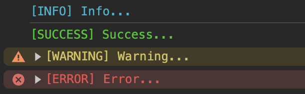

<div align="center">

# 🎨 `kittylog`
Pretty logs in JavaScript

</div>

<br />

KittyLog is a JavaScript library that makes your logs visually appealing and easy to understand. It helps organize information clearly and adds colors and styles to make messages stand out.



You can't find the log you need? Checkout the [Contributing guide](CONTRIBUTING) and open an issue to let us know and, if you wish, you can open a PR to have the feature inclued in the command!

## Table of Contents

  - [⚙️ Installation](#installation)
  - [⚡️ Basic Usage](#quickstart)
  - [🤔 Contributing](#contributing)
  - [💻 Setup Locally](#setup-locally)
  - [📖 License](#license)


### <a id="installation"></a> ⚙️ Installation

Using npm:

```bash
$ npm install kittylog
```

Using pnpm:

```bash
$ pnpm add kittylog
```

Using yarn:

```bash
$ yarn add kittylog
```

### <a id="quickstart"></a> ⚡️ Quickstart

#### Use ES6 Modules

```js
import kittylog from "kittylog";

kittylog.info("Info...");
kittylog.success("Success...");
kittylog.warning("Warn...");
kittylog.error("Error...");
```

#### Use CommonJS Modules

```js
const kittylog = require("kittylog");

kittylog.info("Info...");
kittylog.success("Success...");
kittylog.warning("Warn...");
kittylog.error("Error...");
```

### <a id="contributing"></a> 🤔 Contributing

Read the [Contributing guide](./CONTRIBUTING.md) for the contribution process

### <a id="setup-locally"></a> 💻 Setup locally

If you're cloning the repo, both for contributing or just to start taking confidence with the code just follow these steps:

    1. clone the repo with `git clone https://github.com/pietrodev07/kittylog`
    2. inside the folder run `pnpm install`

### <a id="license"></a> 📖 License

This project was developed and built under [MIT](LICENSE) license